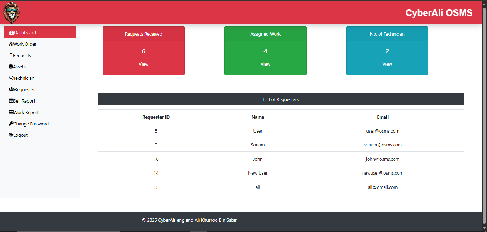
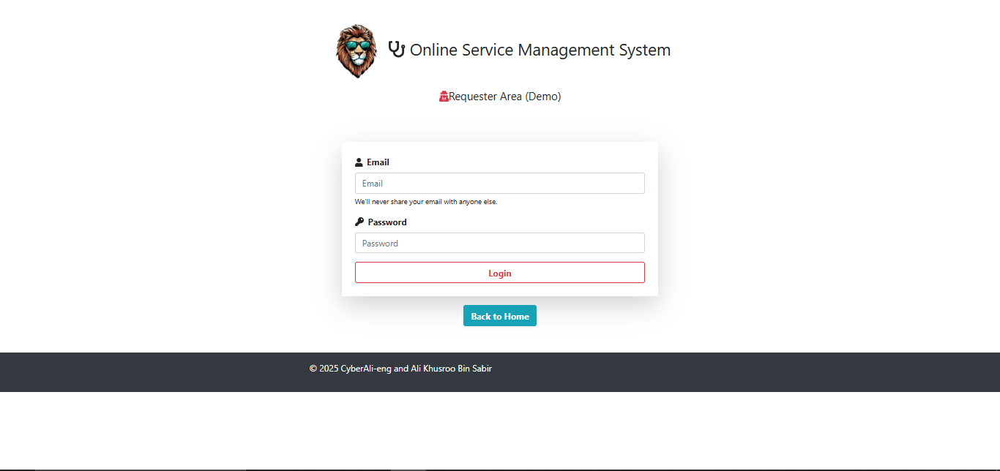
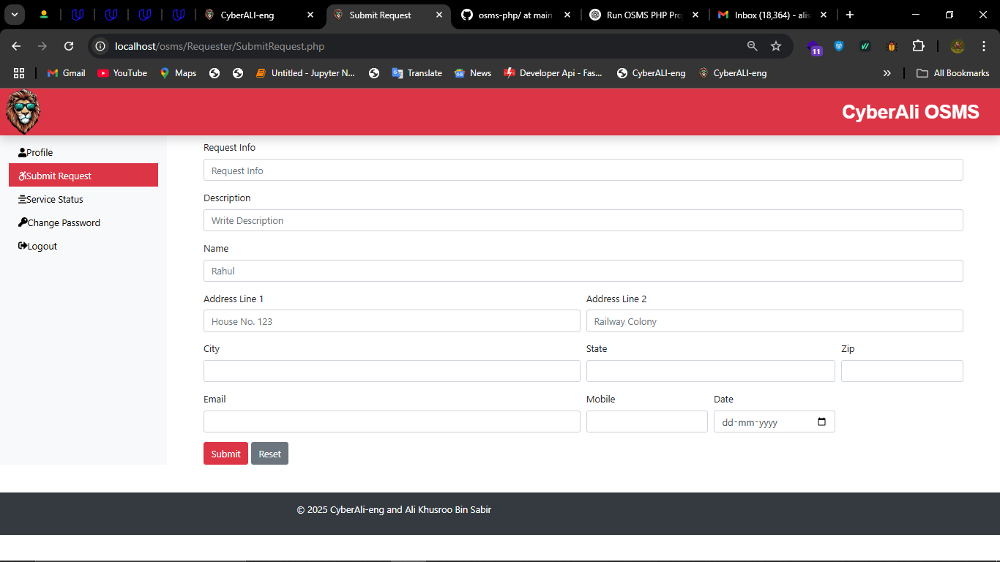
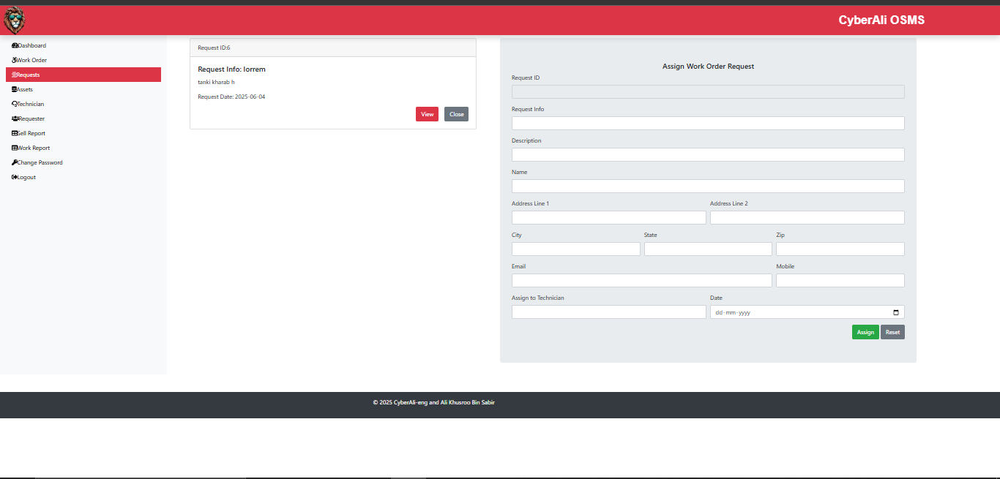

# 🛠️ Online Service Management System (OSMS) - PHP Project

This is a web-based Online Service Management System (OSMS) built using **PHP, MySQL, HTML, CSS, JS, and Bootstrap**. The system helps users to request services and admins to manage and track service requests efficiently.

---

## 🔧 Features

- 🔐 Admin & User login
- 📝 Submit and manage service requests
- 📊 Admin dashboard for monitoring
- 💬 Contact form
- 📂 MySQL database integration
- 🎨 Responsive UI using Bootstrap
- 📁 Clean file structure

---

## 🚀 Getting Started

### 🧑‍💻 Requirements

- WAMP/XAMPP Server
- PHP 7.x or higher
- MySQL/MariaDB
- Browser (Chrome/Firefox)

### 📦 Installation Steps

1. **Clone the repository:**

   ```bash
   git clone https://github.com/CyberAli-eng/osms-php-project.git

2. **Move the project folder into your web directory:**

- For WAMP: C:/wamp64/www/

- For XAMPP: C:/xampp/htdocs/

3. **Import the database:**

- Open phpMyAdmin

- Create a new database named newosms

- Import the newosms.sql file from the project folder

4. **Run the project:**
   ``` bash
   http://localhost/osms-php-project/
   
## 👥 Default Login Credentials

|Role   | Username       | Password |
|-------|----------------|----------|
|Admin  |admin@osms.com  | 123456   |
|User   |user@osms.com   | 123456   |

## 📸 Screenshots

### Admin Dashboard  


### Login Page  


### Submit Request Form  


### Service Allotment Page  


## 🙋‍♂️ Author
- Ali Khusroo Bin Sabir
- 📧 alisabir97570@gmail.com
- 🔗 LinkedIn : www.linkedin.com/in/ali-khusroo-bin-sabir
- website: https://cyberali-eng.github.io/CyberALI-eng-portfolio/


